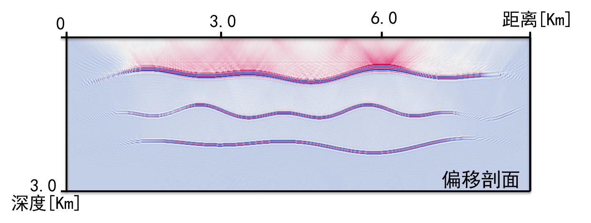

# 2D-VTI-FD-RTM-mpich

Copyright (C) Rong Tao, all rights reserve.

[Rong Tao](https://github.com/Rtoax)

- 👋 Hi, I’m [@rtoax](https://github.com/Rtoax), you can see me in [@linux-visor](https://github.com/linux-visor) too.
- 👀 I’m interested in [Linux](https://github.com/torvalds/linux)
- 🌱 I’m currently learning [Linux](https://github.com/torvalds/linux)
- 💞️ I’m looking to collaborate on [libcareplus](https://github.com/Rtoax/libcareplus), [test-linux](https://github.com/Rtoax/test-linux) and [more](https://github.com/Rtoax).
- 📫 How to reach me [GitHub](https://github.com/Rtoax), [CSDN](https://rtoax.blog.csdn.net/), [Gitee](https://gitee.com/rtoax) and 哆啦Linux梦.

# 详情

这是一个基于MPICH的VTI介质逆时偏移成像，在linux终端下实现。[translation: This is an MPICH-based VTI media reverse-time migration imaging, implemented under the Linux terminal]

## dependence

* ```Compiler```: GNU/GCC, mpich(mpicc, mpirun)
* ```OS```: Linux(CentOS, Ubuntu...)

## conventional migration 常规结果


## optimization migration 优化结果



## 可调控的观测系统


## wave equation


## laplacian filter Copyright(C) Madagascar

```c
void laplac2_lop(int adj, int nz, int nx, float *in, float *out)
/*< linear operator >*/
{
    int iz,ix,j;

    for (ix=0; ix < nx; ix++) {
	for (iz=0; iz < nz; iz++) {
	    j = iz+ix*nz;

	    if (iz > 0) {
		if (adj) {
		    out[j-1] -= in[j];
		    out[j]   += in[j];
		} else {
		    out[j] += in[j] - in[j-1];
		}
	    }
	    if (iz < nz-1) {
		if (adj) {
		    out[j+1] -= in[j];
		    out[j]   += in[j];
		} else {
		    out[j] += in[j] - in[j+1];
		}
	    }

	    if (ix > 0) {
		if (adj) {
		    out[j-nz] -= in[j];
		    out[j]    += in[j];
		} else {
		    out[j] += in[j] - in[j-nz];
		}
	    }
	    if (ix < nx-1) {
		if (adj) {
		    out[j+nz] -= in[j];
		    out[j]    += in[j];
		} else {
		    out[j] += in[j] - in[j+nz];
		}
	    }
	}
    }
}
```
